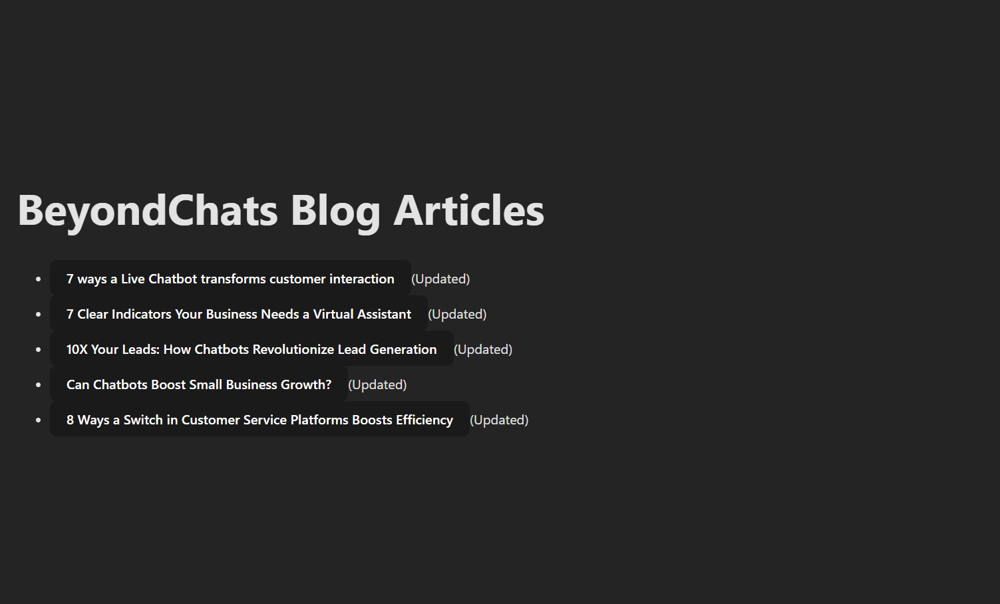
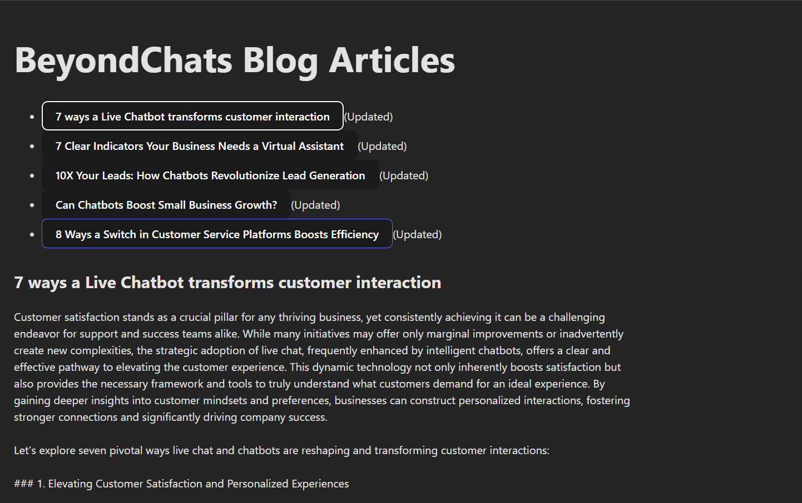

# InsightForge – AI-Powered Blog Scraping & Content Enhancement System

A full-stack system that scrapes blog articles, exposes REST APIs, and
automatically enhances content using external references and AI.


---

## Project Architecture

## Project Architecture Diagram

```mermaid
flowchart TD
    A[Frontend<br/>React + Vite] -->|HTTP Requests| B[Backend API<br/>Express.js]

    B -->|CRUD Operations| C[(MongoDB Atlas)]

    D[Automation Script<br/>Node.js] -->|GET / PUT Articles| B

    D -->|Search Queries| E[Google Search<br/>(SerpAPI)]
    D -->|Content Enhancement| F[Google Gemini API]

    E --> D
    F --> D
...


---


### Architecture Overview
- The frontend consumes REST APIs exposed by the backend to display blog articles.
- The backend handles scraping, persistence, and CRUD operations using MongoDB.
- A standalone automation script periodically enhances articles by:
  - Fetching unprocessed articles
  - Scraping external references via Google Search
  - Enhancing content using the Gemini LLM
  - Publishing updates back through the backend APIs


---


## Phase 1 – Blog Scraping & REST API 

### Objective
- Scrape the latest blog articles from BeyondChats
- Store them in a MongoDB database
- Expose RESTful CRUD APIs for article management

### Tech Stack
Node.js (ES Modules), Express.js, MongoDB Atlas, Mongoose, Axios, Cheerio, dotenv

### Core Features
- Scrapes the **latest 5 blog articles** from: https://beyondchats.com/blogs/
- Extracts title, excerpt content, and source URL
- Prevents duplicate inserts using unique `sourceUrl`
- Idempotent scraper (safe to re-run)
- Clean and standard REST API design

### Article Fields
- `title`
- `content` (initial excerpt)
- `sourceUrl` (unique)
- `isUpdated`
- `createdAt`, `updatedAt`

### API Endpoints
- `GET /api/articles`
- `GET /api/articles/:id`
- `POST /api/articles`
- `PUT /api/articles/:id`
- `DELETE /api/articles/:id`

---

## Phase 2 – Automated Article Enhancement

### Overview
Phase 2 automates the enhancement of existing blog articles using external references and an AI language model.  
This phase is implemented as a standalone automation script and uses the Phase 1 CRUD APIs to publish updates.

---

### What Has Been Implemented

#### 1. Article Fetching
- Fetches existing articles via REST API
- Skips articles already marked as updated
- Uses article title and original content as base input

#### 2. External Reference Scraping
- Uses **SerpAPI** to search Google for relevant reference articles
- Scrapes content from external sources for contextual enrichment

#### 3. AI-Based Content Enhancement
- Integrates **Google Gemini (gemini-2.5-flash)** using the official SDK
- Generates improved article content using:
  - Original article content
  - External reference content
- Ensures:
  - No verbatim copying
  - Original intent preserved
  - Improved clarity, structure, and depth

#### 4. Publishing Enhanced Articles
- Appends reference links at the bottom of the enhanced article
- Publishes the updated article using existing CRUD APIs
- Marks articles as updated to prevent reprocessing

#### 5. Automation Script
- Implemented in `automation/updateArticles.js`
- Runs independently using Node.js
- Safe to re-run (idempotent)
- Environment variables loaded securely from backend `.env`

---

## Tech Stack (Phase 2)
- Node.js (ES Modules)
- MongoDB + Mongoose
- SerpAPI (Google Search)
- Google Gemini API (`@google/generative-ai`)
- Axios, dotenv

---

## Execution Proof (Phase 2)

### Automation Script Output


### MongoDB Updated Articles


---

## Phase 3 - Frontend

To visually validate the backend APIs and AI-enhanced content, a minimal frontend was added.


## Execution Proof (Frontend)

### Frontend UI – Article Viewer


---

### MongoDB Atlas – Updated Articles


---

### Overview
- Fetches articles from the backend REST API
- Displays scraped and AI-enhanced blog content
- Reflects updates made during Phase 2 automation

---

### Tech Stack (Frontend)
- React (Vite)
- Axios
- Plain CSS (Will Replace With Tailwind Later)
